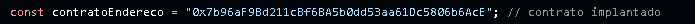

<h1 align="center"> TRANSVERAL PROJECTS-University of Brasília(UnB)</h1>

  

## 📘TRANSVERSAL PROJECTS

Final project for the course Transversal Projects, focused on building a DApp for academic attendance recording using blockchain technology.

## 🚀About the Project

This project is a DApp designed for practical academic verification. Each university event generates a unique smart contract address, which interacts with the participant’s wallet (MetaMask), ensuring their attendance is securely and permanently recorded on the blockchain.

## 🛠️Technologies Used

    Solidity – smart contract development (EventoPresenca.sol)
    GitHub Pages – free hosting for the DApp
    HTML + JavaScript – frontend interface for MetaMask interaction
    ether.js- library for connecting the interface to smart contract

## 📄Features

    Attendance registration via MetaMask transaction
    Emits a PresencaRegistrada event upon successful registration
    Allows public retrieval of registered data (obterComprovante())
    Checks if a wallet has already registered (jaCompareceu())

## 🌐Access the DApp
Visit the live app: https://andreeetmt.github.io/PROJETOSTRANSVERSAIS/
or scan the qr code (which would be necessary in real life practice)

## 📷Presentation
The slide deck is available in SLIDES.pdf

PROJETOSTRANSVERSAIS

├── index.html           → main DApp interface

├── script.js            → interaction logic using Ethers.js

├── EventoPresenca.sol   → smart contract code

├── SLIDES.pdf           → presentation slides

└── README.md            → this documentation

## 👨‍🎓 Author
André Toussaint
University Registration: 241038058
André, a Technology and Network Engineering student, is passionate about decentralized solutions that simplify academic systems.

## 📦 How to Use
1. Open the file `EventoPresenca.sol` in [Remix](https://remix.ethereum.org) and deploy the contract  
2. Copy the deployed **contract address** and paste it into the `script.js` file (look for the `contratoEndereco` variable)
   
  **replace with your deploy address->**
   

4. Save your changes and open the website (hosted via GitHub Pages)  
5. Enter your full name — this will be linked to your wallet  
6. Approve the transaction via MetaMask  
7. ✅ Your attendance is now verified and permanently stored on the blockchain!
   > 🔍 **Note:** You can verify the interaction between your wallet and the exact deployed smart contract address using blockchain explorers (e.g. [Etherscan](https://etherscan.io)) by searching the MetaMask wallet address you used during the transaction.

## 📱 Access via QR Code
Scan the QR code below to access the DApp website directly:

